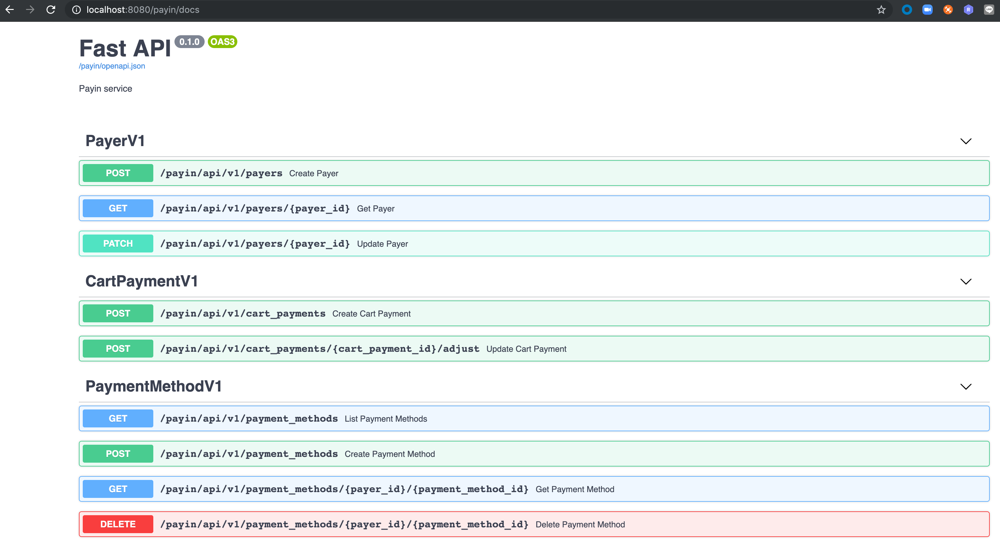
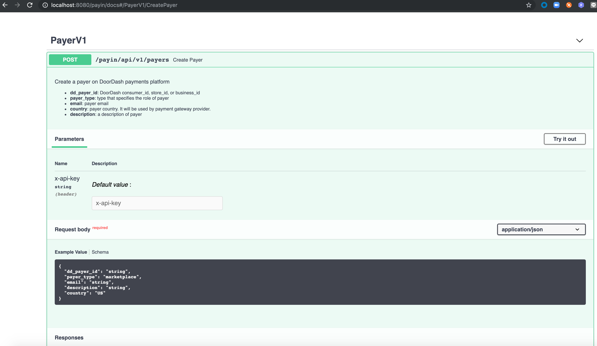

# Payment Service Client Integration

## Before Start
Before start integration, something developer should know first:
- Payin Service API Design Docs available [here](https://docs.google.com/document/d/1cnIx3TTkTZYkuuvCYc0XysdNixOippd5g8uzzKLIcms/edit?ts=5d14f007#heading=h.r76fhvcd081g)
- Payin Service exposes REST interfaces
- Payin Service APIs are full-compatible with existing DSJ clients. Please read client migration guide [here](https://docs.google.com/document/d/1QVl2LdZMIpSz2129WaYSx99b9QhKE38lhbmlMZ4_jhM/edit#heading=h.6k4cn0qqf3m1)


## Environment
- Staging: Payin Service is deployed on Staging along with Stripe Sandbox. Client can test against Staging environment for almost all of features.
- Local staging:
  - Unit Test: clients mock the the Payment Service APIs.
  - Integration Test: (short-term solution) interact with Payment Service on Staging.

## Integration Step by Step
1. Request IDS API Key by [here](https://doordash.atlassian.net/wiki/spaces/PE/pages/762970379/Identity+Service#IdentityService-Services,ClientsandTokensTerms). Payin Service enforces IDS authentication. Client needs to acquire a valid API Key and provide in HTTP request header x-api-key for each request.

2. Experience Payin Service through FastAPI doc. This is the fastest way to experience Payin Servie PAIs without changing any line of code.

   1. login Staging:
   ```bash
    dd-toolbox kubernetes-auth login --environment staging
   ```
   2. port forwarding:
   ```bash
   kubectl port-forward deployment/payment-service-web 8080:80
   ```
   3. open browser, and type:
   ```bash
   http://localhost:8080/payin/docs
   ```
   4. you will see the following view and able to issue request to Payin Servie on Staging (with valid API Key)



3. `Client Library`. We provided OpenAPI generated client library (python only for now). Please see [here](https://github.com/doordash/payment-service-python-client/tree/master/payin) for detailed information.


# Golden Examples
(WIP) We will provide separate examples to showcase the major scenarios. Now we refer to our pulse tests as the golden workflows are already covered by pulse tests.
- Payers:
  - [create payer and update default payment method](https://github.com/doordash/payment-service/blob/master/pulse/tests/payin/test_end_to_end.py#L9)
- PaymentMethods:
  - [create/attach/detach payment method](https://github.com/doordash/payment-service/blob/master/pulse/tests/payin/test_end_to_end.py#L9)
- CartPayments:
  - [create cart_payment](https://github.com/doordash/payment-service/blob/master/pulse/tests/payin/test_cart_payment.py#L14)
  - [order cart adjustment with higher amount](https://github.com/doordash/payment-service/blob/master/pulse/tests/payin/test_cart_payment.py#L72)
  - [order cart adjustment with lower amount](https://github.com/doordash/payment-service/blob/master/pulse/tests/payin/test_cart_payment.py#L94)
